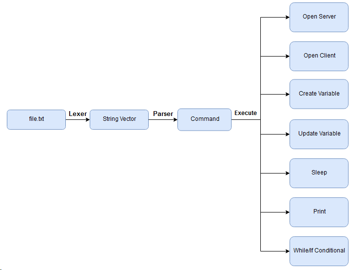

# FlightSim Project
#### Advanced Programming Course in Bar-Ilan University, 2019-2020
The FlightSim Project revolves around builiding a platform to communicate with the [FlightGear](https://www.flightgear.org/) open-source flight simulator using a custom programming language that we parse and convert to actual commands to the simulator.

[Github Repository](https://github.com/Dimmzy/flightsim)


## Usage
Build the source using the g++ compiler and run the program with the file you'd like to parse as an argument
```bash
g++ -std=c++14 */*.cpp *.cpp -Wall -Wextra -Wshadow -Wnon-virtual-dtor -pedantic -o a.out -pthread

./a.out fly.txt
```

## Structure
### Milestone 1
The first part of the project is handling an input file which we parse and perform actions according to the commands specified in the file.

We'll be using the **Command design pattern** to implement our functionality.



<sub><sup>[*] Flowchart created using [drawio](https://www.draw.io/)</sup></sub>

## Contributors
[Dima](https://github.com/Dimmzy)   
[Haim](https://github.com/HaimIsakov)
